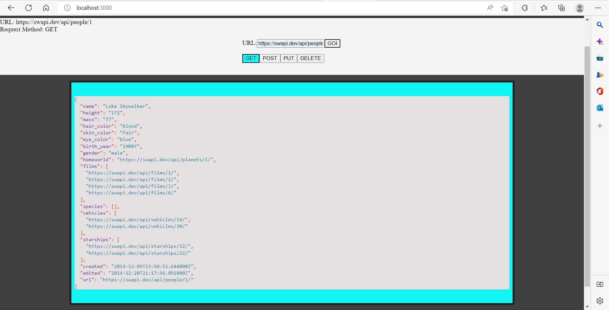
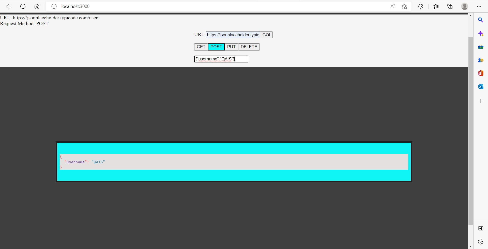

# resty
## [PR](https://github.com/qaisalmanasra/resty/pull/)
## [Netlify](https://roaring-chaja-db8135.netlify.app/)
## 
## Lab 26 features 
* Convert all child components of App.js from classes to functions
* Use .scss files to style each component
* Core application functionality remain unchanged
## Lab 27 features 
* User enters an API URL
* Chooses a REST Method
* Clicks the “Go” button
* Application fetches data from the URL given, with the method specified
* Displays the response headers and results separately
* Both headers and results should be “pretty printed” JSON
## Lab 27 features 

